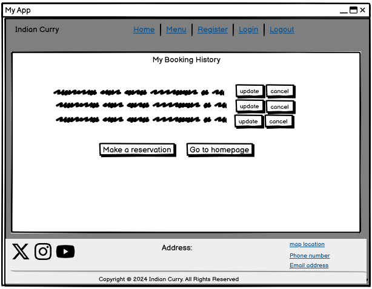
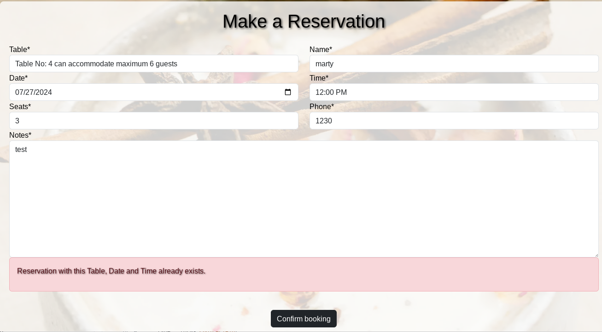
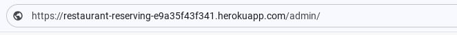

# INDIAN CURRY

Indian Curry is a full-stack, responsive website built for fictional restaurant business for education purpose only.

The website consists of a Menu page, with the list of food items available and also a table reservation facility which can be accessed on user creating an account and then book, view, edit and delete table reservations.

[Link to the live website of Indian Curry](https://restaurant-reserving-e9a35f43f341.herokuapp.com/)

## Table of Contents
* [Overview](#overview)
* [Agile Methodology](#agile-methodology)
* [User Experience (UX)](#user-experience-ux)
    * [Strategy / Site Goals](#strategy--site-goals)
    * [Scope / User Stories](#scope--user-stories)
    * [Structure / Design Choices](#structure--design-choices)
    * [Skeleton / Wireframes](#skeleton--wireframes)
    * [Surface](#surface)
* [Features](#features)
    * [Existing Features](#existing-features)
    * [Future Features](#future-features)
* [Technologies Used](#technologies-used)
* [Testing](#testing)
* [Bugs](#bugs)
* [Deployment](#deployment)
    * [Forking the GitHub Repository](#forking-the-github-repository)
    * [Creating a Local Clone](#creating-a-local-clone)
* [Credits](#credits)
* [Acknowledgements](#acknowledgements)

[Back To Top](#INDIAN-CURRY)

____

## Overview

Indian Curry is a responsive, mobile-first build website.  It is compatible with all current major browsers.  The website is built for educational purposes, using Bootstrap and the Django Framework. It gives users the ability to register for an account and reserve a table in advance. It includes role-based permissions and full CRUD functionality on reservations.

[Back To Top](#table-of-contents)

____

## Agile Methodology

The plan for this project was carried out using Agile Methodology. GitHub Issues, which can be viewed [here](https://github.com/Pramilashanmugam/Restaurant/issues), were used to record the User Stories.  

Each User Story contains Acceptance Criteria and Tasks which I sometimes had to change after I did the process, as I wasn't yet sure what needed to be done to achieve the Acceptance Criteria I aimed for.

Since this was my first project using this methodology and the Django framework, some of the estimated story points were way off. In practice, a few of these tasks were completed faster than anticipated, while others took much longer. 

The [MoSCoW Method of Prioritisation](https://www.agilebusiness.org/dsdm-project-framework/moscow-prioririsation.html) was also used, classifying each User Story as a 'Must Have', 'Should Have' or 'Could Have'. Some "Won't Have's" didn't make it into the project and were left in the Backlog for a future iteration. It is important to note here, that by writing only enough User Stories to reach the Minimum Viable Product(MVP).

Instance of Kanban Board, screenshots of Epics and User Story

Kanban Board at this Iteration

As a whole, I found using the Agile Methodology of great benefit as it helped me to better organise the development of my project. Although I didn't give myself a specific duration for each iteration, it helped me to also manage my time better. It also felt good to move Tasks from 'to do' to  'Done' column when it was completed.

[Back To Top](#table-of-contents)

____

## User Experience (UX)

### Strategy / Site Goals

Indian Curry restaurant aims to satisfy all the customers by maintaining an updated and user-friendly website with an online menu, reservation system, and contact information with map. It displays the story of the restaurant founder, as well as the attractive reasons for visiting Indian curry.

____

### Scope / User Stories

This section aims to determine what a user would expect from interacting with the website. Each User Story was recorded in [GitHub Issues](https://github.com/Pramilashanmugam/Restaurant/issues).  Scenarios of actions each type of user, including the business owner, wishes to take are listed below. Developer User Stories were also added to this section.

**As a Admin/Business Owner**

* As an admin, I want to add, update, and delete tables in the system so that I can maintain accurate table information. [#8](https://github.com/Pramilashanmugam/Restaurant/issues/8)

* As an admin, I want to create, update, and delete reservations so that I can assist users with their bookings. [#10](https://github.com/Pramilashanmugam/Restaurant/issues/10)

* As an admin, I want to view a list of all reservations so that I can manage booking schedules. [#9](https://github.com/Pramilashanmugam/Restaurant/issues/9)

**As a User**

* As a new user, I want to register an account so that I can access the reservation system. [#1](https://github.com/Pramilashanmugam/Restaurant/issues/1)

* As a registered user, I want to log in to my account so that I can manage my reservations. [#2](https://github.com/Pramilashanmugam/Restaurant/issues/2)

* As a user, I want to view a list of available tables so that I can see my options for making a reservation. [#4](https://github.com/Pramilashanmugam/Restaurant/issues/4)

* As a logged-in user, I want to make a reservation for a table on a specific date and time so that I can dine at the restaurant. [#5](https://github.com/Pramilashanmugam/Restaurant/issues/5)

* As a logged-in user, I want to view a list of my current and past reservations so that I can keep track of them. [#6](https://github.com/Pramilashanmugam/Restaurant/issues/6)

* As a logged-in user, I want to cancel an upcoming reservation so that I can change my plans if needed. [#7](https://github.com/Pramilashanmugam/Restaurant/issues/7)

* As a user, I want to receive a confirmation message after making a reservation so that I know it has been successfully booked. [#11](https://github.com/Pramilashanmugam/Restaurant/issues/11)

* As a user, I want to receive a confirmation message after canceling a reservation so that I know it has been successfully canceled. [#12](https://github.com/Pramilashanmugam/Restaurant/issues/12)

* As a user, I want the reservation system to be accessible on different devices (desktop, tablet, mobile) so that I can make and manage reservations conveniently. [#13](https://github.com/Pramilashanmugam/Restaurant/issues/13)

* As a user, I want to see clear error messages if something goes wrong (e.g., trying to book a table that is already reserved) so that I understand what the issue is and how to resolve it. [#15](https://github.com/Pramilashanmugam/Restaurant/issues/15)

The following User Stories were added features to the website which was not included in the initial kanban board as these features were developed during the development stage which make the website run more smoothly and give the users a better experience using the website. 

**As a Developer**

* I can add a favicon to the tab with website's title so that it gives users more visual feedback when looking at their tabs on their browser.

* I can display success and error messages upon form submission so that the user has a better experience with the site.

* I can restrict access on users' reservation so that only the logged in user and admin are able to access, update and delete said user's reservation.

* I can place validations on the datefield so that users are not allowed to pick dates in the past and dates/times that have already been booked.

* I can place validations on the seats so that users are not allowed to enter number of guest above the table capacity.

* I can restrict user to enter a maximum of 1000 characters in the note field.

* I can restrict the entry in name field as only alphabets.

___

### Structure / Design Choices

The website offers simplicity and consistency within its structure.  Its structure was designed to be responsive on screens from 320px up to 2560px.

The Navigation menu displays the Indian Curry logo and a Hamburger button (on mobile) with links to the Home, Menu, Register, Login and Logout pages, for easy navigation. The Navigation menu is repeated across all pages.

The Footer displays social media links which open in a separate tab for ease of use. It also displays the Restaurant's address and contact informations, including map, phone and email links which open in a separate tab. The footer is also repeated across all pages to keep the design uniform and for ease of access.

The Home Page clearly delineates the purpose of the site with 3 large Hero which consists of the name of the business, a slogan and buttons to navigate to menu and table booking.  Other informations like story is included.

The Menu Page gives a more detailed description of the various food items in different categories, like Starter, Main course, Kids menu, Beverage and Desserts. It also provides the link to book a table and view already reserved tables.

The Registeration & Authentication Pages, also accessed through the Navigation Menu, welcome the users to the service and are simple, clear and conform with the standards used across the web.

The Make a Reservation and My booking history pages, are accessed only for registered user to book, update, delete his/her table reservations.

The Database Schema used for this project

Two custom models have been implemented in this project.

* **The Table Model** - Table to Reservation has One-to-Many (A table can have multiple reservations over time):

    - id (PK)
    - table_number
    - seating_capacity

* **The Reservation Model** - User to Reservation: One-to-Many (A user can make multiple reservations):

    - id (PK)
    - user_id (FK)
    - table_id (FK)
    - name
    - date
    - time
    - guests
    - phone
    - notes

___

### Skeleton / Wireframes

Wireframes were first sketched with pen and paper. This method helped me with brainstorming, deciding the most essential parts for the website and getting a feel for the website as a whole. They were then wireframed in [Balsamiq](https://balsamiq.com/wireframes/) to give a closer indication of the design.  Through the design phase some elements were changed to allow for a better user experience.

Balsamiq Wireframes

**Home Page**

**Menu Page**

**Make a Reservation**

**My Booking History**

**Cancel Confirmation**

**Update a Reservation**

**Signup**

**Signin**

**SignOut**

___

### Surface

This section defines the visual language of the website.

* Colour Scheme

Mostly White and Black colour palette was chosen for this website text and background. The logo has a wine colour palette. The other colourful colours like red, green, yellow was used on buttons.

* Typography

Arial and sans-serif fonts were used throughout the website.

* Icons

[uxwing](https://uxwing.com/) social media, map, phone and email icons were used for the Footer.  They are used as interactive links and have an aria-label which gives the relevant information to screen readers to read out to the users.

[Back To Top](#table-of-contents)

____

## Features

### Existing Features

**Header & Navigation**

Featured on all pages, the fully responsive header includes:

* A link on the Logo which brings the user to the home page.
* A hamburger button on mobile which opens up a navigation list with links to the Home, Menu, Register and Login pages. This helps reduce the clutter on the header by keeping the page links neatly stowed away until the user navigates to the hamburger button.
* Links to the Home, Menu, Register and Login pages on tablet and desktop which help the user to navigate easily from page to page, without having to revert back to the previous page via the back button. 
* The last two links change depending on the user's status. If the user is not logged, in the Register and Login links are displayed, while the Profile and Logout links are displayed if the user is logged in.

Click to view screenshots of Navigation features

        Navigation closed on mobile  

        Navigation open on mobile

        Navigation open for logged user mobile

        Navigation on tablets & desktops

        Navigation for logged user on tablets & desktops

**Footer**

Featured on all pages, the responsive footer is valuable to the users as it encourages them to get in touch via phone or email if they prefer that method of contact and it also allows the users to keep connected via social media. It includes:
* The business's address and a map location is given to reach us.
* Contact details are links which direct the user to the relevant apps. On mobile, the telephone number when clicked will bring up a call feature, while the email address will open up an email app on tablet or desktop as well.
* Social links open in a new tab so that users are not directed away from the website. 
* A Simple Copyright disclaimer shown at the bottom of the footer.
* All links have a pointer cursor to help users identify them as links.

Click to view screenshots of Footer features

        Footer on mobile 

        Footer on tablet/desktop 

 

**Landing Page**

The Home page hero on the Landing page takes up more than half the viewport of any screen size. It includes a carousel with three images of indian dishes, spices and the restaurant interiors. A slogan which captures the essence of indian food is included on each image.  It also acts a Call to Action(CTA) as it includes two buttons inviting the user to book a Table and view the Menu.  The button has a hover and focus effect as demonstrated below. 

Click to view screenshots Landing page features

        Landing page on mobile

        Landing page on tablet/desktop

 

**Home Page Content**

The Home page displays further content which gives the user a brief story of the founder and why to choose to open this restaurant. It includes:
* A short story for establishing this restaurant.
* About the person from whom the founder got inspired in cooking.
* It describes the authentic taste of indian kitchen and spices.

Click to view screenshots of other Home page content

        Home content on mobile

        Home content on tablet/desktop

 

**Menu Page**

The responsive Menu page is reachable via the Menu link in the navigation bar as well by clicking the 
"Our Menu" button on all three images on the carousel on Home page. It includes the following:
* More detailed information on the restaurant opening timing for Lunch and Dinner.
* The Menu is very well categorised as Appetizers, Main Course, Indian Breads, Desserts, Beverages and Kids Menu, which enhances the customer experience.
* The background and text are very well styled for a better visual experience.

Click to view screenshots of the Menu page

        Menu page on mobile

        Menu page on tablet/Desktop

 

**Register**

The website has the functionality for a user to register for an account.  
* The fully responsive registration form can be accessed through the navigation bar or when user click on sign up link in Sign in page.  
* At the top it also has a link to the Login form for users who have already registered for an account. The cursor changes to pointer when lands on signup. 
* It uses django-allauth to provide all the settings for user authentication and includes the fields below.  The form was extended to also include fields for first and last name.

    - Username (unique)
    - Email (optional)
    - Password
    - Password repeat

* The Register page's styles are consistent with the rest of the website.  The form is submitted via the Signup button at the bottom of the form. This button provides good contrast against the white background of the form and has a hover effect when cursor lands on the button.
* When the users click on the Signup button they are directed to the Home page, on navbar you will see only logout replacing register and login links.

Click to view screenshots

 

**Login**

A register user can access the login form through the navigation bar or also when clicked on book a table button on Home and menu pages, view my booking button on menu page user will be redirected to signin page if not already logged in.  
* It includes a small welcome back message and a link to the Sign up form for users who have not yet registered for an account.
* It uses django-allauth to provide all the settings for user authentication and includes the following fields:  

    - Username
    - Password

* The responsive Login page is styled in a consistent manner with the rest of the website.  The form is submitted via the sign in button at the bottom of the form. This button provides good contrast against the white background of the form and has a hover effect when mouse lands on the button.
* When users click on the Login button they are directed to the home page.

Click to view screenshots

 

**Logout**

The website has functionality for a logged in user to log out.
* The Logout form can only be accessed from the navigation bar and only when the user is logged in.
* It confirms with the logged in user that they want to log out.
* Its style is consistent with the rest of the webpage and it is fully responsive.
* The Sign Out button logs out the users and directs them back to the Home page.

Click to view screenshots

 

**Make a Reservation**

The website gives the user the functionality to book/reserve a table via the book a table button on the Home and Menu pages.
* A user must be logged in to access the Make a reservation page.
* If a logged in user tries to book a table without filling in the reservation form, they will get a notice directing them to first fill in the form in the make a reservation page.  
* All the fields in the form are set as required field, hence any field left blank will not allow user to book a table until it is filled.
* The style is consistent with the rest of the webpage and it is fully responsive.
* The Table and Time fields are dropdown fields, from which the user can select a value.
* The Name Field accepts only alphabets and if any other character entered, a message asking user to enter only alphabets appears. 
* The Seat Field accepts only numbers > 0, negative numbers are not accepted.
* The Phone Field accepts only numbers, if invalid input received a error message will guide user to enter only number.
* The Date field only accepts current and future dates upto 6 months from the current date. Mondays are not accepted as restaurant is closed on mondays.
* The Time field lists the time slots according the restaurant open time and is also validated along with the Date field so that it doesn't accept double bookings.
* The Note Field can accept a maximum of 1000 character.
* If the information entered does not pass validation, the Submit button directs the user back to the form.  Error messages point out the fields not passed and an error alert is displayed on the bottom of each field. 
* If the information entered passes validation, the Submit button directs the user back to the My booking history page, where they can view their existing and new booking. 
* Each booking will have corresponding edit/update and cancel button for the user to manipulate his booking.

Click to view screenshots

        When fields left empty, it notices a message with hovered on link

        Booking a table with valid datas

        TableSeat validation - seat number should not be more than the capacity of the table

        Error message on name field if non alphabet character enter

        Datefield Validation - only monday

        DateTime Validation - already booked

        Seat Validation - number should not be 0 and negative

        Phone Validation - only numbers are accepted

        Notes Validation - should not exceed 1000 characters

        Successful reservation- with valid datas, reservation confirmation

 

**View Bookings**

The website gives the user the functionality to read more details about their appointments via the View my booking button on Menu page or after valid data entry received from make a reservation page it redirects to My booking history page.
* A user must be logged in to access the My booking history page.
* When the user clicks on the View my bookings button in the Menu page, only reservations done from the particular logged in users data will be displayed on page.
* This consists of a Make a reservation and Go back to Homepage buttons which directs the user back to respective pages. 
* Each reservation includes:
  - the Name, 
  - Number of guests
  - the Date & Time of reservation, 
  - The table number booked and the capacity of the table, 
  - an Update and a Cancel button.
* The information on the reservation changes if customer chose to update using update button and also when a reservation id deleted. View screenshots below for details. 
* The style is consistent with the rest of the webpage and it is fully responsive.  All buttons have focus and hover effects.

Click to view screenshots

        My booking history page

        When an existing reservation is updated

        When a reservation is cancelled

 

**Admin Panel**

The website offers the business owner the functionality to view and interact with the database in the Django Admin panel.
* The panel is reachable by typing `/admin/` at the end of the website's URL in the URL bar.
* This brings the user to the Django Administration Login Page, where the user is asked for their Username and Password.  Only users with Superuser status has permission to login. 
* The Superuser has permissions to add, change, delete and view everything while the user with the status of staff has only certain permissions granted by the Superuser.
* The restaurant owner has been granted the Superuser status for now, in order to have full access of the Admin's Panel. 
* The registered Reservation and Table models can be viewed in the Admin Interface where tables for Reservations and Tables are listed under the relevant app names. Accounts and Authentication & Authorisation list tables with information gathered through registration. 
* The Superuser can add a Table and its capacity in the add table option
      
* Using the menu on the far right, the Superuser is also able to filter this reservation table by:

    - Date
    - Time
    - User
    - Table

* The Superuser can also use search option to filter the field he wants from the reservations table 

Click to view screenshots

        Reaching the Admin Panel

        Django Administration Login Page

        Django Administration Interface

        Django Administration Interface for Reservation

        Django Administration Interface for Table

 