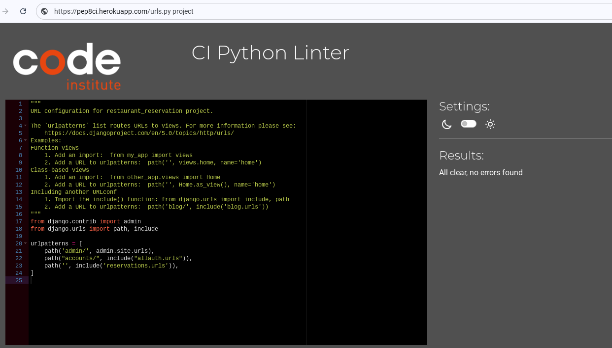

# Table of Contents

* [Code Validation](#code-validation)
* [Lighthouse](#lighthouse-testing)
* [Responsiveness](#responsiveness-testing)
* [Browser Compatibility](#browser-compatibilty-testing)
* [User Stories](#user-story-testing)

_____

## Code Validation

### HTML

HTML code was tested using the [W3C Validator](https://validator.w3.org/) via text input.  The HTML code was copied and pasted in from each page of the website's source code.

Screenshots and results for all templates.

 

**HOME**

**Menu**

**SIGNUP/REGISTER**

**LOGIN**

**Make a reservation**

**LOGOUT**

**My booking history**

**Update page**

**Delete page**

 

[Back To Top](#table-of-contents)

_____

### CSS

CSS code was tested using the [W3C CSS Validation Service](https://jigsaw.w3.org/css-validator/) via text input. 

Screenshot with results for the styles.css file

**styles.css**

 

[Back To Top](#table-of-contents)

_____

### Python

Python code was tested using [Code Institute's Python Linter](https://pep8ci.herokuapp.com/).

Screenshots and results for all python files

**restaurant_reservation**

* settings.py

Line too long warning for line 116, 124, 127, 130, 133 was unaltered as it is Django code and not making any alterations as advised by fellow slackmembers.

* urls.py

**reservations**

* admin.py

* apps.py

* forms.py

* models.py

* views.py

 

[Back To Top](#table-of-contents)

_____

## Lighthouse Testing

[Lighthouse](https://developer.chrome.com/docs/lighthouse/overview/) was used to audit the website for performance, accessibility, best practice and SEO.  This was run in Chrome DevTools in incognito mode. 

Screenshots and results for all pages

**HOME**

* Mobile

* Desktop

**Menu**

* Mobile

* Desktop

**Register**

* Mobile

* Desktop

**Login**

* Mobile

* Desktop

**LOGOUT**

* Mobile

* Desktop

**Make a reservation**

* Mobile

* Desktop

**My booking history**

* Mobile

* Desktop

**update**

* Mobile

* Desktop

**delete**

* Mobile

* Desktop

 

[Back To Top](#table-of-contents)

_____

## Responsiveness Testing

The website is responsive for screens with a mininum width of 320px and a maximum width of 2560px. Friends and family tested the website on their devices and all reported no issues with responsiveness.  Further manual tests were done using Chrome's DevTools.

Screenshots of website at different screen sizes.

**NAVBAR & HOME HERO**

 

[Back To Top](#table-of-contents)

_____

## User Story Testing

As mentioned in the Agile Methodology Section in the [README](/README.md), User Stories were created in [GitHub Issues](https://github.com/Pramilashanmugam/Restaurant/issues) which guide the process for this project all the way from Setup to Testing. Each User Story has been manually tested and the results have been collected in the tables below.

        Navbar

|                   |                                      |                                                 |
| :---------------: | :----------------------------------: | :---------------------------------------------: |
|      Scenario     |               Expected               |                      Result                     |
|   click on logo   |      should navigate to homepage     |   **Pass**- as expected navigates to homepage   |
|   click on Home   |      should navigate to homepage     |   **Pass**- as expected navigates to homepage   |
|   click on Menu   |   should take navigate to Menu page  |   **Pass**- as expected navigates to Menu page  |
| click on Register |  should take navigate to signup page |  **Pass**- as expected navigates to signup page |
|   click on login  |  should take navigate to signin page |  **Pass**- as expected navigates to signin page |
|  click on logout  | should take navigate to signout page | **Pass**- as expected navigates to signout page |

        Buttons in Carousel

|                                                                    |                                                         |                                                                                        |
| :----------------------------------------------------------------: | :-----------------------------------------------------: | :------------------------------------------------------------------------------------: |
|                              Scenario                              |                         Expected                        |                                         Result                                         |
|                      click on Our Menu Button                      |               should navigate to Menu page              |                      **Pass**- as expected navigates to Menu page                      |
|   scenario 1: click on Our Book a Table, when user not logged in   | should navigate to signin page if not signed in already |        **Pass**- as expected navigates to signin page when not already logged in       |
| scenario 2: click on Our Book a Table, when user already logged in |        should navigate to make a reservation page       | **Pass**- as expected navigates to make a reservation page when user already logged in |

        Social Medias icon in Footer

|                         |                                                   |                                                                           |
| :---------------------: | :-----------------------------------------------: | :-----------------------------------------------------------------------: |
|         Scenario        |                      Expected                     |                                   Result                                  |
| click on instagram icon | should navigate to instagram in a seperate window | **Pass**- as expected navigates to instagram website on a separate window |
|  click on tweeter icon  |  should navigate to Tweeter in a seperate window  |  **Pass**- as expected navigates to Tweeter website on a separate window  |
|  click on youtube icon  |  should navigate to Youtube in a seperate window  |  **Pass**- as expected navigates to Youtube website on a separate window  |

        Contacts links on Footer

|                             |                                                             |                                                                        |
| :-------------------------: | :---------------------------------------------------------: | :--------------------------------------------------------------------: |
|           Scenario          |                           Expected                          |                                 Result                                 |
|  click on location/map icon |         should navigate to map on a seperate window         |   **Pass**- as expected navigates to google map on a separate window   |
| click on phone number/ icon | should navigate to your phone contacts on a seperate window | **Pass**- as expected navigates to phone contacts on a separate window |
|     click on email icon     |   should navigate to your email link on a seperate window   |   **Pass**- as expected navigates to email link on a separate window   |

        Buttons on Menu page

|                                                                          |                                                                                                                                                                                                                          |                                                                                                                                                                                                                                                                                                                 |
| :----------------------------------------------------------------------: | :----------------------------------------------------------------------------------------------------------------------------------------------------------------------------------------------------------------------: | :-------------------------------------------------------------------------------------------------------------------------------------------------------------------------------------------------------------------------------------------------------------------------------------------------------------: |
|                                 Scenario                                 |                                                                                                         Expected                                                                                                         |                                                                                                                                                      Result                                                                                                                                                     |
|     scenario 1: click on Book a Table button, when user not logged in    |                                                                                  should navigate to signin page if not signed in already                                                                                 |                                                                                                                    **Pass**- as expected navigates to signin page when not already logged in                                                                                                                    |
|   scenario 2: click on Book a Table button, when user already logged in  |                                                                                        should navigate to make a reservation page                                                                                        |                                                                                                              **Pass**- as expected navigates to make a reservation page when user already logged in                                                                                                             |
|   scenario 1: click on View my booking button, when user not logged in   |                                                            should navigate to signin page if not signed in already and should not display the booking history.                                                           |                                                                                       **Pass**- as expected navigates to signin page when not already logged in and did not display the booking history when not logged in                                                                                      |
| scenario 2: click on View my booking button, when user already logged in | 1. should navigate to (my booking reservation) reservation list. 2.should display all the bookings related to the corresponding user. 3.when reservation is zero, should display a message stating no reservation found. | **1. Pass**- as expected navigates to (my booking reservation) reservation list when the user already logged in. **2. Pass -** as expected displays the booking history related to the corresponding user. **3. Pass -** as expected displays a message stating no reservation found, when reservation is zero. |

        Buttons on My Booking History

|                                         |                                                                                                                                                                                                                                                                                                                                               |                                                                                                                                                                                                                                                                                                                                                                                                                                                                 |
| :-------------------------------------: | :-------------------------------------------------------------------------------------------------------------------------------------------------------------------------------------------------------------------------------------------------------------------------------------------------------------------------------------------: | :-------------------------------------------------------------------------------------------------------------------------------------------------------------------------------------------------------------------------------------------------------------------------------------------------------------------------------------------------------------------------------------------------------------------------------------------------------------: |
|                 Scenario                |                                                                                                                                                                    Expected                                                                                                                                                                   |                                                                                                                                                                                                                              Result                                                                                                                                                                                                                             |
|        click on **update** button       |           1. onclick should navigate to the corresponding booking in make a reservation page. 2. I should be able to change each and every content in the list or any particular content in the list. 3. after updating the changes when i click on confirm booking, the updated details have to reflect in my booking history page.          |                                                      **1. Pass**- as expected navigates to the corresponding booking detail in the make the reservation page. **2. Pass** - as expected i am able to update all the existing content in the list or any particular content on the list. **3. Pass** - as expected on clicking on confirm booking, the updated details reflects on my booking history page.                                                      |
|        click on **Cancel** button       | 1. should navigate to the confirm cancellation page. 2. should display a message to reconfirm the decision of cancellation. 3. on clicking on confirm, the booking should be removed from customer booking history. 4. on clicking on cancel, the booking is retained and no cancellation is processed and navigates back to booking history. | **1. Pass**- as expected navigates to the confirm cancellation page. **2. Pass** - as expected displays a message asking the user to reconfirm the cancellation. **3. Pass** - as expected on clicking on the confirm button, the booking is removed from the users booking history page. **4. Pass** - as expected on clicking on the cancel button, the booking is retained and no cancellation is processed and same reflects on users booking history page. |
|  click on **make a reservation** button |                                                                                                                                                   should navigate to make a reservation page                                                                                                                                                  |                                                                                                                                                                                                   **Pass** - as expected navigates to make a reservation page.                                                                                                                                                                                                  |
| click on **Go back to homepage** button |                                                                                                                                                        should navigate to the home page                                                                                                                                                       |                                                                                                                                                                                                        **Pass** - as expected navigates to the home page.                                                                                                                                                                                                       |

        Make a reservation form

|                |                                                                                                                                                                                                                                                       |                                                                                                                                                                                                                                                                                                                                                                                                                                                                                                                                 |
| :------------: | :---------------------------------------------------------------------------------------------------------------------------------------------------------------------------------------------------------------------------------------------------: | :-----------------------------------------------------------------------------------------------------------------------------------------------------------------------------------------------------------------------------------------------------------------------------------------------------------------------------------------------------------------------------------------------------------------------------------------------------------------------------------------------------------------------------: |
|    Scenario    |                                                                                                                        Expected                                                                                                                       |                                                                                                                                                                                                                                                              Result                                                                                                                                                                                                                                                             |
|   Table Field  |                                                                                               1. users can choose a table from the given list of tables.                                                                                              |                                                                                                                                                                                                                            **Pass** - as expected the list of tables is shown for the user to choose.                                                                                                                                                                                                                           |
|                |                             2. Table is a required field, hence the field cannot be left blank, if left blank the reservation will not be accepted and a message prompting customers to choose the table to be displayed.                             |                                                                                                                                                                          **Pass** - as expected if the user did not choose a table from the list, the reservation is not accepted and a message prompting the customer to choose a table is displayed.                                                                                                                                                                          |
|   Name Field   |                                                                   1. Should accept only the alphabets. 2. It should be a required field, that an empty field should not be accepted                                                                   |                                                                                                                        **1.Pass** - as expected this field accepts only the alphabet. when numbers or special characters entered it prompts customers to enter only the alphabet. **2.Pass** - as expected if the field is empty the form is not accepted and prompts the customer to enter his/her name.                                                                                                                       |
|   Date Field   |           1. Should accept only from next date from the current system date and no past dates 2. Should not accept a date beyond 6 months from the current date 3. It should be a required field, that an empty field should not be accepted          |                                                     **1. Pass** - as expected, accepts from the next date from the current system date and past dates were deactivated. **2.Pass** - as expected accepts date until 6 months from the current date, if the date is more than 6 months an message displayed to user to choose a date less than 6 months. **3.Pass** - as expected if the field is empty the form is not accepted and prompts the customer to enter the date.                                                     |
|   Time Field   |                                                         1. Should accept time from the given set of time slots. 2. It should be a required field, that an empty field should not be accepted.                                                         |                                                                                                                                                               **1.Pass** - as expected, time can be chosen only from the given list of time. **2.Pass** - as expected, if the field is empty the form is not accepted and prompts the customer to enter the time.                                                                                                                                                               |
|   Seats Field  |                    1. Should accept only numbers >=0, not negative numbers to be accepted 2. The number of guests cannot exceed the table's capacity. 3. It should be a required field, that an empty field should not be accepted                    | **1. Pass** - as expected 0, negative (-1) numbers are not accepted. A message prompts the customer to enter a valid number **2. Pass** - as expected if the number of guests is above the table capacity the field is not accepted. for ex if table capacity is 3, when i enter 4 a message asking customers to choose a different table appears as the number of guests is over the capacity of table. **3. Pass** - as expected, if the field is empty the form is not accepted and prompts the customer to enter the field. |
|   Phone Field  |                                          1. Should accept only numbers and should not accept alphabets and special characters. 2. It should be a required field, that an empty field should not be accepted.                                          |                                                                                                                   **1.Pass** - as expected, only numbers are accepted. If alphabets or special characters entered, prompts customers with a message asking to enter only numbers. **2.Pass** - as expected, if the field is empty the form is not accepted and prompts the customer to enter the phone field.                                                                                                                   |
|   Notes Field  |                                                   1. Text field which should accept only a maximum of 1000 characters. 2. It should be a required field, that an empty field should not be accepted.                                                  |                                                                                                            **1.Pass** - as expected, the text field accepts only characters below 1000, when characters are above 1000 a message pops up saying it cannot have more than 1000 characters. **2.Pass** - as expected, if the field is empty the form is not accepted and prompts the customer to enter the text field.                                                                                                            |
| Confirm button | 1. only after receiving input for all fields with valid data the form should get updated in the database on clicking Confirm booking button 2. Booking should get updated in database and navigates to my booking history page on successful booking. |                                                                                                                                    **1.Pass** - as expected, only after receiving the valid inputs for all fields the form is updated in the database. **2.Pass** - as expected, after successful booking the page navigates to my booking history page and displays the successful booking.                                                                                                                                    |

        Register/signup form

|                      |                                                                                                                                                                                                   |                                                                                                                                                                                                                                                                                                                                                                                                                                                                                                                                 |
| :------------------: | :-----------------------------------------------------------------------------------------------------------------------------------------------------------------------------------------------: | :-----------------------------------------------------------------------------------------------------------------------------------------------------------------------------------------------------------------------------------------------------------------------------------------------------------------------------------------------------------------------------------------------------------------------------------------------------------------------------------------------------------------------------: |
|       Scenario       |                                                                                              Expected                                                                                             |                                                                                                                                                                                                                                                              Result                                                                                                                                                                                                                                                             |
|    username empty    |                                                                    If the username is blank prompts the user to fill the field                                                                    |                                                                                                                                                                                                             **Pass** - as expected, if the username field is blank, message prompts user to fill the username field                                                                                                                                                                                                             |
| email field optional |                                                                           form should get accepted without email address                                                                          |                                                                                                                                                                                                                   **Pass** - as expected, the form gets accepted without email address as it is optional field                                                                                                                                                                                                                  |
|    Password field    | 1. Password should be minimum 8 character 2. Commonly used password should not be accepted 3. Passwords cannot be fully numeric 4. Passwords should not be same as the other personal information | **1.Pass** - as expected, characters less than 8 are not expected and prompt the user to enter a minimum 8 characters. **2.Pass** - as expected, password like testing123 is not accepted and advises the user to choose a different password. **3.Pass** - as expected, if the password entered is fully numeric like 12345678, a message saying the password is fully numeric is displayed. **4.Pass** - as expected, when password entered was similar to the user id, message asking to enter a different password appears. |
|     Signup button    |                                       Signup button should accept the valid datas and get logged in as user and should be able to access the table bookings                                       |                                                                                                                                                                                                       **Pass** - as expected, after valid data received signed in as the useruser and is able to access the table bookings                                                                                                                                                                                                      |

        Signin

|                |                                                                                                                                                                                           |                                                                                                                                                                                                                                               |
| :------------: | :---------------------------------------------------------------------------------------------------------------------------------------------------------------------------------------: | :-------------------------------------------------------------------------------------------------------------------------------------------------------------------------------------------------------------------------------------------: |
|    Scenario    |                                                                                          Expected                                                                                         |                                                                                                                     Result                                                                                                                    |
| username empty |                                                                If the username is blank prompts the user to fill the field                                                                |                                                                    **Pass** - as expected, if the username field is blank, message prompts user to fill the username field                                                                    |
| Password field | 1. only a valid password corresponding to the username should get accepted. 2. if the user name or password was entered incorrectly, a message should prompt the user to check his entry. | **1. Pass** - as expected, only a valid password corresponding to the user was accepted. **2. Pass** - as expected, a message "The username and/or password you specified are not correct." displayed to user stating his entry is incorrect. |

        Signout

|                              |                                                                                                                                                                                     |                                                                                                                                                                                                                                                                                    |
| :--------------------------: | :---------------------------------------------------------------------------------------------------------------------------------------------------------------------------------: | :--------------------------------------------------------------------------------------------------------------------------------------------------------------------------------------------------------------------------------------------------------------------------------: |
|           Scenario           |                                                                                       Expected                                                                                      |                                                                                                                                       Result                                                                                                                                       |
| on clicking logout on navbar | 1. Should prompt the user to confirm the logout. 2. on confirm by clicking signout. User should get signedout. 3. user cannot access booking history or table booking after signout | **1. Pass** - as expected, user is prompted to confirm his logout. **2. Pass** - as expected, when the signout button clicked the user gets signed out from his account. **3. Pass** - as expected, user was unable to access the booking history and table booking after signout. |

        Django administration login

|                                  |                                                                                                                                                                                                                                            |                                                                                                                                                                                                                                                                                                                                            |
| :------------------------------: | :----------------------------------------------------------------------------------------------------------------------------------------------------------------------------------------------------------------------------------------: | :----------------------------------------------------------------------------------------------------------------------------------------------------------------------------------------------------------------------------------------------------------------------------------------------------------------------------------------: |
|             Scenario             |                                                                                                                  Expected                                                                                                                  |                                                                                                                                                                   Result                                                                                                                                                                   |
| Should accept only the superuser | 1. Should accept only the super user user id and password. 2. If a non superuser try to access a message "Please enter the correct username and password for a staff account. Note that both fields may be case-sensitive." should display | **1. Pass** - as expected, only the superuser user id and password is accepted. **2. Pass** - as expected, when a non superuser with user id - test, password - restaurant try to log in the admin a message "Please enter the correct username and password for a staff account. Note that both fields may be case-sensitive." displayed. |
|         Reservation model        |                                                                                          superuser can view all the reservations by different user                                                                                         |                                                                                                                                **Pass** - as expected, superuser can view all the reservations for his hotel                                                                                                                               |
|                                  |                                                                                       superuser can edit/update the existing reservations of any user                                                                                      |                                                                                                                      **Pass** - as expected, superuser can edit/update any existing reservations of a different user.                                                                                                                      |
|                                  |                                                                                          superuser can delete an existing reservation of any user                                                                                          |                                                                                                                     **Pass** - as expected, with superuser was able to delete existing reservation of a different user.                                                                                                                    |
|                                  |                                                                                                     superuser can add a new reservation                                                                                                    |                                                                                                                                       **Pass** - as expected, superuser is able to add a new booking                                                                                                                                       |
|            Table model           |                                                                                                   superuser can add a table with capacity                                                                                                  |                                                                                                                                **Pass** - as expected, superuser is able to add a new table and its capacity                                                                                                                               |
|                                  |                                                                                                   superuser can delete the existing table                                                                                                  |                                                                                                                               **Pass** - as expected, superuser is able to delete existing table in the list.                                                                                                                              |

[Back To Top](#table-of-contents)

[Back to README.md](README.md)